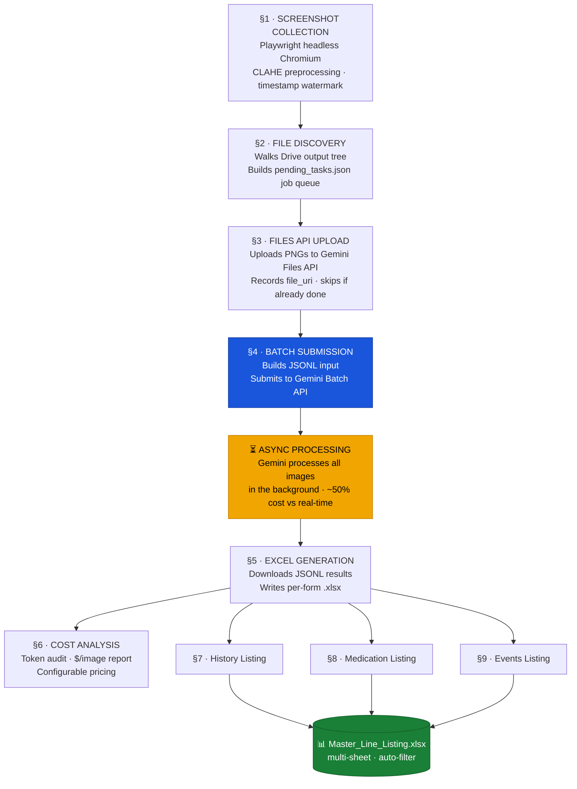

# 🔬 Image-to-Structured Data Pipeline


> _"Turning visual form data into structured, queryable records — automatically, at scale, and at a fraction of the cost of real-time inference."_

---

> [!IMPORTANT]
> **This pipeline is built around the Gemini Batch API — not real-time inference.**
> Processing 300+ form images costs under **$1.50** and requires zero infrastructure.
> [See why this matters ↓](#-why-batch-api-not-real-time-inference)

---

## The Problem This Solves

Structured data often lives trapped inside web-based forms — clinical records, surveys, inspection sheets, registration portals. Exporting it programmatically is rarely an option. The data exists visually, and someone has to read it.

This pipeline automates that entire workflow end-to-end:

1. **Captures** form pages as screenshots via a headless browser
2. **Pre-processes** each image for maximum LLM readability
3. **Extracts** structured data using Gemini's vision capabilities
4. **Outputs** clean Excel files ready for analysis
5. **Generates** consolidated line listings across all records

Everything runs inside Google Colab with Drive as persistent storage — no servers, no infrastructure, no maintenance.

---

## 🏗️ Pipeline Architecture



---

## ⚙️ How Each Stage Works

| #   | Stage                                  | Key Mechanism                                                                   | Idempotent?                     |
| --- | -------------------------------------- | ------------------------------------------------------------------------------- | ------------------------------- |
| 1   | **Screenshot Collection**              | Playwright headless Chromium + CLAHE contrast enhancement + timestamp watermark | ✅ Skips if PNG exists          |
| 2   | **File Discovery & Snapshot**          | Walks Drive output tree, builds `pending_tasks.json` job queue                  | ✅ Skips if snapshot exists     |
| 3   | **Files API Upload**                   | Uploads PNGs to Gemini Files API, records `file_uri` per task                   | ✅ Skips if `file_uri` recorded |
| 4   | **Batch Preparation & Submission**     | Builds JSONL, checks for active job before creating new one                     | ✅ Reuses existing job          |
| 5   | **Output Download & Excel Generation** | Downloads JSONL results, writes per-form `.xlsx` next to each PNG               | ✅ Skips existing `.xlsx`       |
| 6   | **Token Usage & Cost Analysis**        | Parses `usageMetadata`, computes `$/image` with configurable pricing            | —                               |
| 7–9 | **Line Listings**                      | Field-mapping dicts aggregate all forms into a master multi-sheet Excel         | ✅ `if_sheet_exists='replace'`  |

---

## 🧠 Why Batch API, Not Real-Time Inference?

This is the most consequential architectural decision in the pipeline, and it was made deliberately.

When you have hundreds or thousands of form images to process, calling the Gemini API image-by-image in real time creates three compounding problems: **cost**, **rate limits**, and **fragility**. A single API timeout mid-run means partial results and manual recovery. Rate limits cap your throughput. And real-time pricing adds up fast.

The Gemini Batch API sidesteps all three. You submit a JSONL file with every request, walk away, and download structured results when processing is done. The pipeline handles job state tracking, resumption, and idempotent retries automatically.

|                       | Real-Time API            | Batch API                         |
| --------------------- | ------------------------ | --------------------------------- |
| Latency               | Seconds per image        | Async — hours for full batch      |
| Cost                  | Standard pricing         | **~50% discount**                 |
| Rate limits           | Hit quickly at scale     | None — async queue                |
| Failure handling      | Manual per-request       | Job-level — retry the whole batch |
| Infrastructure needed | Keep process running     | None — fire and forget            |
| Best for              | Interactive, small-scale | **Bulk processing ✅**            |

For any dataset beyond ~20 images, the batch approach is the only economically and operationally viable path. **Processing 312 form images in this pipeline costs under $1.50 total.**

---

## 🎯 Use Cases

This pipeline is domain-agnostic. Any workflow where structured data is locked inside web-based form images is a candidate:

**Clinical & Research**

- eCRF (electronic Case Report Form) digitization
- Clinical trial data extraction across multiple visit forms
- Patient history and adverse event line listing generation

**Enterprise & Operations**

- Web portal inspection / audit form capture
- Survey digitization at scale
- Legacy system screenshot-to-spreadsheet conversion

**Data Engineering**

- Building training datasets from labeled web forms
- Ground-truth generation for OCR/document AI benchmarking
- Automated QA on form submission accuracy

---

## 💰 Cost Analysis

The pipeline includes a built-in token usage and cost reporting stage (Section 6). After each batch run, you get a breakdown like:

```
════════════════════════════════════════════════
         TOKEN USAGE & COST REPORT
════════════════════════════════════════════════
  Images processed       : 312
────────────────────────────────────────────────
  Input tokens           : 4,821,504
  Output tokens (incl.)  : 187,392
  Total tokens           : 5,008,896
────────────────────────────────────────────────
  Input cost             : $1.205376
  Output cost            : $0.281088
  TOTAL COST             : $1.486464
────────────────────────────────────────────────
  Avg tokens / image     : 16,054.2
  Avg cost   / image     : $0.004764
════════════════════════════════════════════════
```

> Pricing is configurable via `PRICE_INPUT_1M` and `PRICE_OUTPUT_1M` constants in Section 6.
> Values above use Gemini 3 Flash Batch pricing as of 2025.

---

## 🚀 Quick Start

### Prerequisites

- Google account with Drive access
- [Gemini API key](https://aistudio.google.com/apikey) (free tier works for small batches)
- Google Colab (free or Pro)

### 1. Clone & Open

```bash
git clone https://github.com/YOUR_USERNAME/image-to-structured-data-pipeline.git
```

Open `vision_extraction_pipeline.ipynb` in [Google Colab](https://colab.research.google.com/).

### 2. Set Secrets

In Colab, go to **Tools → Secrets** and add:

| Secret Key       | Description                                   |
| ---------------- | --------------------------------------------- |
| `GEMINI_API_KEY` | Your Gemini API key                           |
| `APP_USERNAME`   | Login credential for the target web app       |
| `APP_PASSWORD`   | Login credential for the target web app       |
| `BASE_URL`       | Base URL of the web application               |
| `TARGET_IDS`     | Comma-separated list of entity IDs to process |

> ⚠️ Never hardcode credentials. All secrets are read via `userdata.get()` — they never appear in the notebook.

### 3. Configure Path

In each section, update the Drive path to match your project folder:

```python
DRIVE_OUTPUT_DIR = "/content/drive/MyDrive/YourProject/output"
```

### 4. Configure Field Mapping (Sections 7–9)

The line listing sections use a `FIELD_MAP` dict to map your form's exact field labels to column names. Update these to match your form:

```python
FIELD_MAP = {
    "diagnosis":  "History Term",   # your form's label → output column
    "onset date": "Start Date",
    "ongoing":    "Ongoing",
    "end date":   "End Date",
}
```

### 5. Run Sections in Order

Each section is self-contained and idempotent — you can re-run safely at any point. The recommended sequence:

```
§1 Screenshot → §2 Discovery → §3 Upload → §4 Submit
                                              ↓
                                         (wait for batch)
                                              ↓
§6 Cost Report ← §5 Download & Excel ← §4.3 Status Check
                                              ↓
                               §7 History + §8 Medication + §9 Events
```

---

## 📁 Project Structure

```
image-to-structured-data-pipeline/
├── vision_extraction_pipeline.ipynb   # Main pipeline notebook (9 sections)
└── README.md
```

**Runtime artifacts** (auto-created by the pipeline, stored in Drive):

```
Google Drive / YourProject/
├── output/
│   └── {entity_id}/
│       └── {visit}/
│           └── {form_name}/
│               ├── {form_name}.png       # Captured screenshot
│               └── {form_name}.xlsx      # Extracted structured data
└── Line_Listings/
    └── Master_Line_Listing.xlsx          # Consolidated output (multi-sheet)
        ├── History_Listing
        ├── Medication_Listing
        └── Events_Listing
```

---

## 🛡️ Design Principles

**Idempotency throughout** — Every stage checks whether its output already exists before doing work. You can interrupt and resume the pipeline at any point without duplicating effort or cost.

**Secrets-only credentials** — No credentials, IDs, or sensitive strings appear in the notebook. Everything is read from Colab Secrets at runtime.

**Separation of concerns** — Each numbered section has exactly one responsibility. The job queue (`pending_tasks.json`) is the single source of truth shared between stages.

**Cost-aware by design** — The batch API, the idempotency guards, and the built-in cost reporting all exist to make large-scale runs predictable and affordable.

---

## 👤 Author

**Kerem Dağlı** · [GitHub](https://github.com/Keremdagli) · [LinkedIn](https://www.linkedin.com/in/kerem-dagli/)

---

## 📄 License

MIT License
